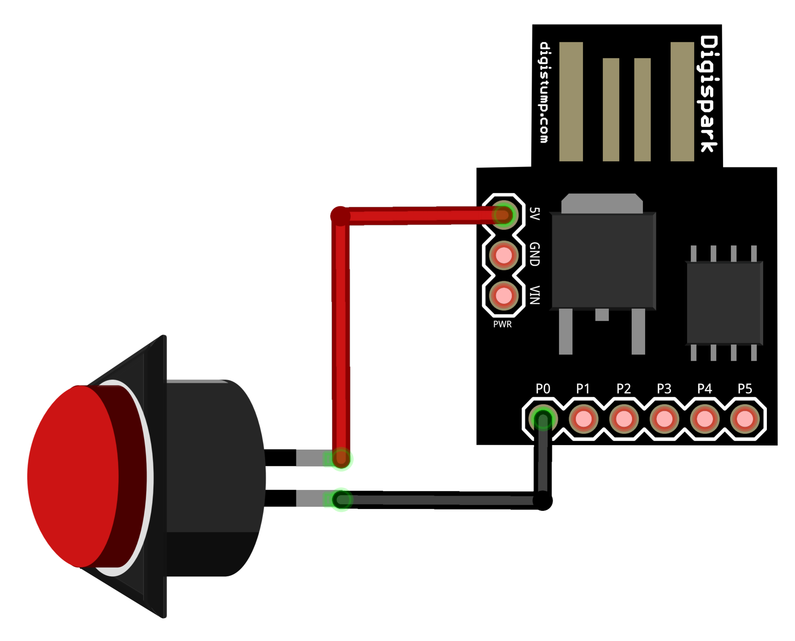
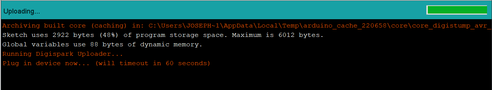
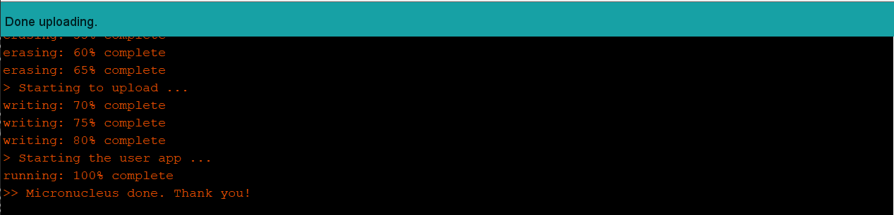

# TAB SWITCH PROTOCOL

> OBJECTIVE ALPHA:  T-01110100
> March 03, 2018 08:28
> Tab populations are out of control! Standard keyboard shortcuts have no effect. Requesting **heavy** ordinance. Initiating...TAB SWITCH PROTOCOL!

This project uses the [Digispark](https://www.ebay.com/itm/General-Digispark-Kickstarter-Attiny85-USB-Development-Board-For-Arduino/272748379725?hash=item3f8111fe4d:g:j9IAAOSwi8VZW9CU) $0.99 micro-controller to make a fun macro-button for switching browser tabs! (or anything else)

> OBJECTIVE BRAVO: A-01100001
> March 04, 2018 21:34
> Previous attempts to combat tab populations have failed. Technological innovation is the only way forward! Design of the *DEDICATED SWITCH* is complete. Construction is underway...

1. Hardware setup is dead-simple. Get a Digispark. Get a button. Wire it up.

2. Program the Digispark with the [Arduino IDE](https://www.arduino.cc/en/Main/Software).
3. Follow the [tutorial](http://digistump.com/wiki/digispark/tutorials/connecting) to add the Digispark to Boards Manager.
4. Open "tab_switch_protocol" code in this repo and press "Upload".

5. Plug in Digispark when prompted. Wait for code to upload.

> OBJECTIVE CHARLIE: B-01100010
> March 05, 2018 12:37
> Intelligence operatives have completed field trials. Navigational effectiveness of the *DEDICATED SWITCH* has exceeded expectations! Adjusting population models with new data. Past simulations exaggerated tab sustainability numbers. The future is bright!

Start mashing the button!
